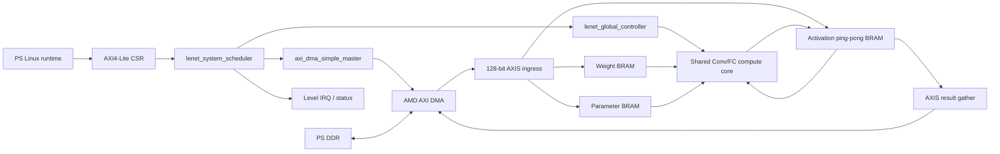

# LeNet-5 KV260 가속기 설계·구현·문제 해결·최적화 종합 보고서

> 이 문서는 `/home/yun/lenet5`의 **최종 active RTL 경로**를 기준으로 작성했다.  
> 초기 아이디어, 현재 사용되지 않는 legacy 모듈, 실제 보드에서 검증된 결과를 구분한다.  
> 관련 기존 노트: [[my_self]], [[SA_Conv1_Architecture]], [[LeNet5_RTL_Implementation_Status_2026-07-25]], [[LeNet5_KV260_Linux_Board_Bringup_Plan_2026-07-25]]

---

## 0. 최종 결론

현재 설계는 다음 범위까지 실제 KV260에서 검증을 끝냈다.

- signed INT8 activation/weight와 INT32 accumulation을 사용하는 LeNet-5 전체 추론
- Conv/FC 공용 physical `4×8` packed systolic array
- bias, ReLU, requantization, signed INT8 saturation
- 2×2 MaxPool
- 전체 weight/parameter on-chip 상주
- activation 8-bank × 2-set ping-pong BRAM
- AXI DMA MM2S/S2MM과 HP0 DDR 경로
- 내부 10-operation controller와 외부 whole-job scheduler
- Linux platform driver, coherent DMA allocation, persistent userspace runtime
- Stage05 150 MHz full implementation/STA/SDF
- 실제 보드 10,000장, 100,000 logit byte Python golden과 완전 일치

최종 보드 결과:

```text
PL input clock             = 99,999,999 Hz
PL fabric clock            = 149,998,501 Hz
Accelerator ID             = 0x00024c35
MNIST board accuracy       = 98.93% (9893/10000)
Golden logit byte match    = 100,000 / 100,000
Resident job cycles        = 평균 12,790.262
Resident job latency       = 약 85.27 us
Stage06 wall throughput    = 9,431.773 images/s
PL job busy                = 80.424%
Timeout/DMA/scheduler error= 0
```

설계의 핵심은 단순히 SA를 만든 것이 아니라, 다음 네 가지 병목을 동시에 해결한 것이다.

1. 단일 BRAM read port로 8개 activation lane을 공급할 수 없는 문제
2. Conv와 FC의 데이터 재사용 방향이 서로 다른 문제
3. SA 결과가 행과 열마다 다른 cycle에 도착하는 문제
4. Linux에서 DMA, clock, reset, MMIO를 안전하게 제어해야 하는 문제

현재 가장 먼저 진행할 최적화는 RTL 확장이 아니라 **fused submit/wait ioctl**이다. 그 다음에는 SA/window/router의 실제 valid/stall counter를 추가해 compute 구간에서 발생하는 feed gap을 측정해야 한다.

---

## 1. 목표 모델과 연산량

### 1.1 네트워크

```text
32×32×1 input
  -> C1 5×5 Conv, 6 channels
  -> S2 2×2 MaxPool
  -> C3 5×5 Conv, 16 channels
  -> S4 2×2 MaxPool
  -> C5/FC1 400 -> 120
  -> F6/FC2 120 -> 84
  -> OUT/FC3 84 -> 10 logits
  -> PS software argmax
```

FC3가 마지막 output layer다. FC3의 출력 10개는 MNIST class별 signed INT8 logit이며 ReLU를 적용하지 않는다.

### 1.2 레이어별 MAC

| 레이어 | 계산 | MAC 수 | 전체 비율 |
|---|---:|---:|---:|
| C1 | `6×28×28×25` | 117,600 | 28.23% |
| C3 | `16×10×10×150` | 240,000 | 57.62% |
| FC1 | `120×400` | 48,000 | 11.52% |
| FC2 | `84×120` | 10,080 | 2.42% |
| FC3 | `10×84` | 840 | 0.20% |
| 합계 |  | **416,520** | 100% |

따라서 성능을 결정하는 핵심은 C1/C3 공급과 SA 활용률이다. FC3의 lane utilization은 낮지만 전체 MAC에서 차지하는 비중은 0.20%이므로, FC3만 최적화해도 전체 처리량 변화는 작다.

---

## 2. 전체 시스템 구조



데이터와 제어를 분리했다.

| 평면 | 프로토콜 | 역할 |
|---|---|---|
| Control | 32-bit AXI4-Lite | ID, descriptor, start, status, counter |
| Bulk data | 128-bit AXI4-Stream + AXI DMA | weight, parameter, input, result |
| DDR access | AXI DMA → 128-bit HP0 | non-coherent PS DDR |
| Completion | polling 우선, level IRQ 지원 | done/error 통지 |

128-bit와 512-bit는 데이터 정밀도가 아니다.

- 실제 activation과 weight 원소는 계속 signed INT8이다.
- 외부 128-bit AXIS는 INT8 16개를 한 beat에 운반하는 DMA packing 폭이다.
- 내부 512-bit weight row는 FC mode에서 한 cycle에 필요한 INT8 weight 64개를 운반하는 on-chip 병렬 폭이다.

---

## 3. 제어 계층을 나눈 이유

### 3.1 실제 제어 ownership

```text
PS runtime
  -> descriptor 제출, buffer 수명, timeout, 결과 검증

lenet_system_scheduler
  -> whole-job 순서
  -> model/input/output DMA
  -> core start/wait
  -> job ID, error, pending descriptor

lenet_global_controller
  -> C1/S2/C3/S4/FC1/FC2/FC3 순서
  -> activation read/write set
  -> layer별 shape, depth, weight/parameter base

local controllers
  -> window row/tap/tile cycle
  -> FC vector cycle
  -> skew/tag delay
  -> result routing
  -> pooling address
  -> AXIS unpack/gather
```

### 3.2 왜 global controller 하나가 모든 row를 직접 제어하지 않는가

Global controller는 각 cycle의 8개 activation row 값을 직접 만들지 않는다. 각 row/lane의 정확한 cycle은 `window_gen_runtime`, `skew_buf`, `sa_packed_dual_mode`가 valid/tag와 함께 만든다.

모든 cycle과 row를 global controller가 직접 제어하면 다음 문제가 생긴다.

- row별 counter와 enable이 중앙 FSM에 몰려 상태 수가 급증한다.
- `valid`, `depth_last`, `lane_mask`가 32개 PE에 고 fanout으로 전달된다.
- 한 row가 stall될 때 다른 데이터와 control tag가 어긋날 가능성이 높다.
- Conv와 FC의 서로 다른 loop 구조가 하나의 거대한 FSM에 섞인다.
- timing failure가 발생했을 때 원인을 모듈별로 분리하기 어렵다.

현재 구조에서는 global controller가 layer descriptor만 고정하고, 로컬 모듈이 해당 descriptor를 cycle-accurate stream으로 변환한다.

### 3.3 SA에 별도 거대 controller가 없는 이유

SA 자체는 다음 입력만 받으면 된다.

```text
activation/weight data
pair_valid
lane_mask
depth_last
common pipeline enable
```

`depth_last`가 각 PE까지 데이터와 동일한 경로로 이동하므로, SA가 별도 `k` counter나 row FSM을 가질 필요가 없다. SA 내부에 다시 controller를 넣으면 source counter와 PE counter가 이중화되어 stall 시 불일치가 생길 수 있다.

---

## 4. 최종 active RTL 모듈별 설계 이유

### 4.0 최종 합성 계층과 레거시 RTL 구분

아래 표는 Stage05 최종 합성 계층에서 실제로 사용되는 모듈을 기능별로 정리한 것이다. Vivado가 작은 wrapper나 조합 논리를 상위 계층에 흡수할 수 있으므로, 계층 utilization 표에 이름이 따로 남지 않더라도 최종 경로에서 인스턴스화되면 active로 분류했다.

| 기능 블록 | 최종 active 모듈 | 담당 범위 |
|---|---|---|
| 물리 top/AXI 경계 | `lenet5_axis_wrapper`, `lenet_axi_lite_regs` | PS 제어, AXI DMA 제어, AXIS payload, IRQ |
| whole-job scheduling | `lenet_system_scheduler`, `axi_dma_simple_master`, `lenet_dma_addr_gen` | model/input/result DMA와 compute의 순서·주소·완료 관리 |
| AXIS 변환 | `axis_lenet_ingress`, `axis_lenet_result` | 128-bit DMA beat와 내부 weight/parameter/activation/result 형식 변환 |
| accelerator subsystem | `lenet5_accelerator_core`, `lenet_global_controller`, `lenet_param_loader` | 고정 LeNet layer/pass sequence와 parameter preload |
| activation storage | `activation_pingpong_subsystem`, `activation_bank_set`, `activation_scalar_reader`, `fc_activation_reader`, `banked_activation_writer` | ping-pong feature-map 저장, 병렬 read/write, byte strobe |
| Conv 공급 | `window_gen_runtime`, `skew_buf` | 7-row FF line buffer, zero-row compaction, SA 시간 정렬 |
| FC 공급 | `fc_vector_gen`, `fc_group_skew` | FC activation vector 생성, group/lane 시간 정렬 |
| weight 공급 | `dual_mode_weight_buffer` | Conv row broadcast와 FC 512-bit 병렬 read |
| compute | `lenet_compute_core`, `sa_packed_dual_mode`, `packed_pe` | Conv/FC mode 선택, 4×8 packed INT8 MAC, 누산·tag 전달 |
| 결과 정렬 | `column_result_router_runtime`, `fc_result_router` | column/group 결과의 one-entry elastic 보관과 writer 전달 |
| requantization | `postprocess_array`, `dual_lane_postprocess` | bias, scale, round, shift, saturation을 8개 column에 병렬 적용 |
| pooling | `banked_maxpool2x2`, `maxpool2x2_int8` | banked 2×2 max pooling과 출력 주소 생성 |

다음 파일들은 과거 단계의 단독 시험, 비교, 또는 교체 전 구조를 보존한 레거시/검증용 RTL이다. 이들을 최종 active 구조의 자원이나 성능에 중복 합산하면 안 된다.

| 레거시/검증 모듈 | 최종 구조에서의 대체 모듈 또는 상태 |
|---|---|
| `window_gen` | runtime shape, prefetch, row-zero compaction을 가진 `window_gen_runtime`으로 대체 |
| `weight_loader` | Conv/FC 통합 병렬 공급이 가능한 `dual_mode_weight_buffer`로 대체 |
| `sa_packed_4x8` 계열 초기 wrapper | `sa_packed_dual_mode`와 `packed_pe` 조합으로 대체 |
| `output_router`의 per-PE FIFO 구조 | 최종 경로에서는 `column_result_router_runtime`/`fc_result_router`의 column별 one-entry elastic slot 사용 |
| `column_result_router` 초기형 | runtime layer 정보와 최종 handshake를 반영한 `column_result_router_runtime`으로 대체 |
| `conv_stream_datapath`, `conv_stream_writeback`, `fc_stream_datapath` 단독 harness | 통합 `lenet_compute_core` 경로의 단계별 bring-up/검증용 |

### 4.1 시스템 경계와 DMA

| 모듈 | 현재 구조와 역할 | 이렇게 설계한 이유 | 이 설계가 없을 때 생기는 문제 |
|---|---|---|---|
| `lenet5_axis_wrapper` | AXI-Lite slave, AXI DMA control master, MM2S/S2MM AXIS, IRQ를 통합 | 물리 top에는 표준 AXI와 소수 신호만 노출 | 내부 512-bit weight/activation 포트를 top으로 노출하면 package I/O가 폭발하고 실제 KV260 배치가 불가능 |
| `lenet_axi_lite_regs` | AW/W 독립 buffer, stable B/R response, command pulse, sticky status | AXI-Lite는 AW와 W가 같은 cycle에 오지 않을 수 있음 | AW/W 동시 도착을 가정하면 실제 PS traffic에서 write 누락 또는 deadlock |
| `lenet_system_scheduler` | descriptor validation, 선택적 model reload, input DMA, core, result DMA, one pending job | PS가 매 phase마다 개입하지 않고 PL이 whole-job을 소유 | PS scheduling latency가 layer 사이에 삽입되고 DMA/core ownership이 불명확해짐 |
| `axi_dma_simple_master` | DMA simple-mode CSR write와 DMASR poll을 수행하는 AXI-Lite master | accelerator가 DMA 시작/완료를 자율 처리 | PS가 DMA CSR과 accelerator CSR을 번갈아 쓰며 race와 많은 ioctl overhead 발생 |
| `lenet_dma_addr_gen` | weight/parameter/input/result unit index를 내부 bank 주소로 변환 | stream adapter와 주소 규칙을 분리하고 stall 시 주소 고정 | adapter마다 주소식을 중복하면 off-by-one과 backpressure 중 주소 이동 문제 발생 |
| `axis_lenet_ingress` | 128-bit beat를 weight 512-bit row, parameter record, input word로 gather/scatter | 외부 bus packing과 내부 memory layout이 다름 | AXIS width를 내부 element width로 오해하거나 beat 경계에서 weight/parameter 순서가 틀어짐 |
| `axis_lenet_result` | 5개의 16-bit logit word를 10-byte AXIS packet으로 gather | 최종 결과는 10 byte라 128-bit beat의 일부만 유효 | `TKEEP=0x03ff` 없이 16 byte를 모두 유효 처리하면 뒤 6 byte가 결과로 오인됨 |

### 4.2 내부 controller와 parameter

| 모듈 | 현재 구조와 역할 | 이렇게 설계한 이유 | 이 설계가 없을 때 생기는 문제 |
|---|---|---|---|
| `lenet_global_controller` | 고정 10-operation layer/pass sequencer | LeNet shape가 고정이므로 작은 descriptor FSM이 가장 안전 | PS가 10번 개입하거나 각 모듈이 self-start하면 set swap과 layer 순서가 깨짐 |
| `lenet_param_loader` | 236개 logical bias/scale을 64 physical postprocess lane에 preload | Conv는 channel parameter를 복제하고 FC는 lane별 parameter가 다름 | postprocessor가 매 output마다 BRAM random read를 하면 read-port와 timing 병목 발생 |
| `lenet5_accelerator_core` | memory, compute, pool, controller를 단일 내부 subsystem으로 통합 | activation ownership과 start/done boundary를 한 곳에서 보장 | 상위 wrapper가 내부 bank와 row를 직접 arbitration해야 해 제어 ownership이 누출됨 |

### 4.3 Activation memory와 reader/writer

| 모듈 | 현재 구조와 역할 | 이렇게 설계한 이유 | 이 설계가 없을 때 생기는 문제 |
|---|---|---|---|
| `activation_bank_set` | 8개의 독립 16-bit true-dual-port bank | 최대 8 channel/column 병렬 access와 pooling A+B read 지원 | 단일 BRAM에 여러 주소를 요구하면 port 부족으로 매 cycle stall |
| `activation_pingpong_subsystem` | 8-bank set 두 개, read set/write set ownership mux | 한 layer가 source를 읽는 동안 다음 결과를 다른 set에 기록 | 같은 memory를 동시에 읽고 덮어써 feature map corruption |
| `activation_scalar_reader` | CHW bank layout을 1 pixel/cycle stream으로 변환, read latency 선발행 | window loader가 BRAM latency 없이 연속 pixel을 받도록 함 | 요청 후 응답을 기다리는 bubble이 매 pixel마다 생김 |
| `fc_activation_reader` | planar layout과 packed FC-result layout을 모두 지원 | S4 출력과 FC 출력의 물리 저장 방식이 다름 | FC2/FC3가 이전 FC 결과를 잘못된 channel/address 순서로 읽음 |
| `banked_activation_writer` | column별 16-bit word write, lane mask를 byte strobe로 변환 | packed 두 lane 중 partial lane만 안전하게 기록 | 마지막 partial tile/FC tail에서 invalid byte가 유효 activation을 덮어씀 |

### 4.4 Window generator

`window_gen_runtime`은 단순 counter가 아니라 다음을 모두 포함한다.

```text
runtime W/H/C latch
7-row FF storage = kernel 5 rows + prefetch 2 rows
circular row-bank management
row-zero detection and active-row compaction
tile/tap/channel counters
8 concurrent tap output
partial-lane zero forcing
prefetch/load overlap
pipeline drain
valid/lane_mask/depth_last generation
```

왜 FF line buffer를 사용했는가:

- Activation BRAM은 cycle당 임의 주소 8개를 직접 읽을 수 없다.
- SA는 한 source cycle에 8개의 spatial activation을 요구한다.
- FF에 저장된 값은 읽어도 소모되지 않으며 Q 출력을 여러 MUX가 동시에 재사용할 수 있다.
- 현재 7-row buffer는 compute 중 두 개 future row를 prefetch해 row 교체 stall을 줄인다.
- runtime maximum은 `7×6×32×8 = 10,752` data FF이며 control/output register를 포함해 hierarchy상 약 11,705 FF를 사용한다.

이 구조가 없을 때:

- BRAM 1 pixel/cycle만으로 SA에 8개 값을 공급할 수 없어 SA가 데이터 starvation에 빠진다.
- BRAM을 row별로 복제하면 activation memory와 write coherence 비용이 크게 증가한다.
- row를 읽을 때마다 삭제되는 FIFO로 구현하면 겹치는 convolution window 재사용이 불가능하다.
- 5×12 작은 tile만 저장하면 다음 tile의 신규 pixel load 시간이 짧은 C1 compute보다 길어 bubble이 커진다.

중요한 점:

- FF line buffer 값은 FIFO처럼 pop되어 사라지지 않는다.
- 같은 pixel은 여러 cycle, 여러 output window에서 반복해서 선택된다.
- `en=0`이면 counter, selected row, valid/tag pipeline을 함께 hold해야 한다.
- data만 멈추고 `valid/depth_last`를 진행시키면 마지막 product가 잘못된 accumulator에 들어간다.

Row-zero compaction:

- 각 line-buffer row가 전부 0인지 load 중 기록한다.
- 0인 kernel row는 `kc×channel` tap 전체를 source stream에서 제거한다.
- `k_out`은 원래 dense weight address를 유지하므로 weight buffer가 같은 row를 자동 skip한다.
- 다섯 input row가 모두 0이면 zero-valued dummy final token을 발행해 결과와 bias가 정상적으로 생성되게 한다.

이 dummy token이 없으면 완전히 0인 window는 `depth_last`를 전혀 만들지 못해 PE accumulator가 완료되지 않고 controller가 기다리거나 결과 하나가 사라진다.

### 4.5 Weight buffer

`dual_mode_weight_buffer`는 8개의 64-bit SDP BRAM bank를 사용한다.

```text
Conv mode:
  bank c의 byte0 = output channel c의 weight
  한 cycle에 8 INT8 weight

FC mode:
  bank c의 64-bit word = 8개의 서로 다른 filter weight
  8 bank 합계 한 cycle에 64 INT8 weight = 512 bit
```

왜 weight는 FF가 아니라 BRAM인가:

- hardware packed weight blob은 92,736 byte다.
- weight는 inference 사이에 바뀌지 않고 address 기반으로 반복 재사용한다.
- 전체를 FF로 만들면 수십만 bit FF와 큰 decode MUX가 필요하다.
- BRAM의 1-read/1-write port 구조가 model preload와 compute read에 잘 맞는다.
- 현재 weight buffer가 BRAM Tile 32개를 사용하지만 LUT/FF 비용은 매우 작다.

이 구조가 없을 때:

- FC mode에서 64개 distinct weight/cycle을 공급하지 못해 32 packed PE 대부분이 stall한다.
- 단일 512-bit giant memory를 비현실적인 단일 macro로 가정하면 BRAM36의 실제 최대 port width와 맞지 않는다.
- layer마다 DDR에서 weight를 다시 받으면 작은 입력/result traffic보다 weight DMA가 지배한다.

나중에 weight buffer를 바꾸는 것은 가능하다. 다만 full FC layer를 포함하고 현재 64-lane throughput을 유지하려면 BRAM banking이 자연스럽다. FF 변경은 작은 실험 모델이나 초저지연 소용량 layer일 때만 유리하다.

### 4.6 Skew buffer

Conv mode의 `skew_buf`:

```text
activation pair group g -> g cycle delay
weight column c         -> c cycle delay
PE[g][c] 도착 cycle     = source(k) + g + c
```

FC mode의 `fc_group_skew`:

- activation group만 `g` cycle 지연한다.
- FC weight는 각 PE에 local로 바로 공급되므로 column weight skew가 필요 없다.

왜 필요한가:

- activation은 좌→우, Conv weight는 위→아래로 각각 한 cycle씩 이동한다.
- 입력단에서 미리 skew하지 않으면 PE마다 서로 다른 `k`의 activation과 weight를 곱한다.
- `valid`, `lane_mask`, `depth_last`도 데이터와 같은 delay chain을 지나야 한다.

Skew 없이 단순 broadcast하면:

- `[0][0]`은 맞아도 `[3][7]`은 최대 10 cycle 어긋난다.
- 마지막 product가 아닌 cycle에 `depth_last`가 도착해 누산 결과가 조기 출력된다.
- global high-fanout broadcast가 timing을 악화시킨다.

### 4.7 Packed PE와 shared systolic array

`packed_pe` 한 개는 DSP48E2 하나로 두 개의 signed INT8 product를 계산한다.

```text
P = ((upper << 18) + lower) × common

prod_lo = signed(P[17:0])
prod_hi = signed(P[35:18]) + P[17]
```

`P[17]` correction이 필요한 이유:

- lower product가 음수면 2의 보수 borrow가 upper packed field를 1 감소시킨다.
- correction을 하지 않으면 upper lane 결과가 특정 음수 lower product에서 1씩 틀린다.

누산은 DSP P feedback이 아니라 외부 INT32 accumulator 두 개에서 수행한다.

왜 output-stationary인가:

- 각 PE의 partial sum을 local INT32 register에 유지한다.
- 매 MAC마다 partial sum을 BRAM으로 읽고 쓰지 않는다.
- depth가 25, 150, 400이어도 마지막에만 결과를 배출한다.

왜 physical 4×8인가:

- packed PE 하나가 logical spatial/filter lane 두 개를 처리한다.
- 32 DSP로 64 logical product lane을 만든다.
- packing이 없다면 같은 병렬성에 64 DSP가 필요하다.

왜 Conv/FC가 같은 SA를 공유하는가:

```text
Conv: packed operands = 두 spatial activation
      common operand  = 한 filter weight

FC:   packed operands = 두 output-filter weight
      common operand  = 한 activation
```

곱셈 회로는 같고 입력 operand 역할만 바꾼다. 별도 FC array를 두지 않아 DSP와 routing을 절약한다.

이 구조가 없을 때:

- C5/FC1을 spatial row 방식으로 처리하면 group0만 사용되어 dominant FC 연산에서 배열 3/4가 idle한다.
- Conv array와 FC array를 따로 만들면 DSP, postprocess, memory interface가 중복된다.
- INT16 이하 accumulator를 쓰면 C3/C5의 긴 dot product에서 overflow 위험이 있다.

### 4.8 FC tail utilization이 낮은 이유

물리 FC 출력 폭은 64 lane이다.

| 레이어 | pass | lane utilization |
|---|---|---:|
| FC1 120 outputs | 64 + 56 | 93.75% |
| FC2 84 outputs | 64 + 20 | 65.63% |
| FC3 10 outputs | 10 | 15.63% |

이는 stall이 아니라 fixed 64-lane array와 layer shape의 불일치다. FC3만을 위해 물리 array를 10 lane으로 줄이면 FC1 처리량이 크게 낮아진다.

### 4.9 Result router와 작은 elastic slot

최종 active 경로는 다음 모듈을 사용한다.

- Conv: `column_result_router_runtime`
- FC: `fc_result_router`

각 column에는 **1-entry registered elastic slot**이 있다. deep FIFO나 SA 전체 뒤의 단일 scalar FIFO는 없다.

왜 column별 slot인가:

- systolic latency 때문에 row마다 결과 도착 cycle이 다르다.
- 구조상 한 column에서 같은 cycle에 유효한 row candidate는 최대 하나가 되도록 source issue 간격과 tag를 맞췄다.
- column 8개는 병렬로 postprocess에 전달해야 한다.
- downstream이 잠시 ready를 내릴 때 payload를 안정적으로 유지해야 한다.

slot이 없으면:

- postprocessor가 한 cycle backpressure를 걸 때 SA 결과가 유실된다.
- valid/ready 조합 경로가 SA까지 길게 이어져 timing과 deadlock 위험이 커진다.

반대로 32 PE 각각에 deep FIFO를 두면:

- 대부분 사용되지 않는 storage와 arbitration logic이 생긴다.
- result ordering과 drain 조건이 더 복잡해진다.

초기 실험용 `output_router.sv`에는 PE별 짧은 FIFO 구조가 있으나, 최종 hierarchy에서는 사용하지 않는다.

### 4.10 Postprocess

`postprocess_array`는 8 column × 2 scalar lane, 총 16개의 requantization DSP를 사용한다.

각 `dual_lane_postprocess`는 다음을 수행한다.

```text
INT32 accumulator
  + INT32 bias
  -> optional ReLU
  -> signed 18-bit Q17 scale multiply
  -> round
  -> arithmetic shift
  -> signed INT8 clamp [-128, 127]
```

왜 SA 다음에 즉시 quantize하는가:

- SA output은 INT32지만 다음 activation과 pooling input 계약은 INT8이다.
- quantization 없이 INT32를 activation BRAM에 저장하면 memory 폭과 BRAM 사용량이 4배가 된다.
- 단순 하위 8-bit truncation은 scale과 saturation이 없어 정확도가 무너진다.
- FC3는 음수 logit이 필요하므로 ReLU를 반드시 bypass한다.

왜 column마다 두 lane인가:

- packed PE가 한 packet에서 두 accumulator를 동시에 완료한다.
- 한 scalar postprocessor만 두면 output burst를 절반 속도로 처리해 router slot이 차고 SA 전체가 stall할 수 있다.

현재 평균 utilization은 낮다. 한 이미지의 requantized output은 6,518개이고 최대 16 output/cycle이므로 compute 전체 기준 유효 lane utilization은 약 3.67%다. 하지만 결과가 depth 마지막에 burst로 나오므로 평균만 보고 즉시 lane을 줄이면 burst backpressure가 생길 수 있다.

### 4.11 Pooling

`banked_maxpool2x2`는 8개의 `maxpool2x2_int8` lane을 병렬 사용한다.

- source set의 port A가 top horizontal pair를 읽는다.
- source set의 port B가 bottom horizontal pair를 읽는다.
- 8 bank가 최대 8 channel output을 동시에 만든다.
- destination set에는 signed INT8 결과를 byte-enable로 기록한다.

왜 pooling 뒤에 다시 quantization하지 않는가:

- max는 입력 네 값 중 하나를 그대로 선택한다.
- 입력과 출력의 scale/zero-point가 같으면 precision이 변하지 않는다.
- 불필요한 multiplier를 넣으면 latency와 DSP만 증가한다.

단일 scalar pooling이면 C1/C3의 channel 병렬성을 버리고 pool phase가 길어진다. 단일-port memory이면 top/bottom 두 행을 같은 cycle에 읽을 수 없다.

### 4.12 Address generation

주소 생성은 하나의 거대한 `address_generator.sv`에 몰아넣지 않았다.

| 경로 | 주소 owner |
|---|---|
| Conv activation read | `activation_scalar_reader` |
| FC activation read | `fc_activation_reader` |
| Conv result CHW address | `column_result_router_runtime` |
| FC result lane/channel address | `fc_result_router` |
| Pool read/write | `banked_maxpool2x2` |
| AXIS payload unit address | `lenet_dma_addr_gen` |
| Layer base/shape/pass | `lenet_global_controller` |

이렇게 나눈 이유:

- 주소 의미를 소비 모듈이 가장 잘 알고 있다.
- valid/ready stall 시 주소와 payload를 같은 모듈에서 함께 hold할 수 있다.
- Conv CHW, FC packed, pooling 2D, DMA sequential 주소식을 하나의 조합 회로에 넣지 않아 timing을 줄인다.

주소 생성기를 전부 중앙화하면 큰 mode MUX와 multiply/add fanout이 생기고, backpressure 시 어떤 주소가 advance해야 하는지 ownership이 불명확해진다.

### 4.13 Clock/reset

최종 Stage05:

```text
PS PL0 reference 약 100 MHz
  -> PL MMCM M=12, D=1, O=8
  -> 149.998501 MHz 단일 fabric domain
  -> SmartConnect, AXI DMA, accelerator

MMCM locked
  -> proc_sys_reset
  -> synchronous reset release
```

단일 fabric domain을 사용한 이유:

- compute, AXIS, DMA control 사이 custom CDC를 제거한다.
- AXI clock converter/async FIFO를 불필요하게 추가하지 않는다.
- reset release를 MMCM lock 이후로 고정할 수 있다.

조합 논리로 clock을 gate하지 않고 register CE를 사용한다. 임의 clock gating은 glitch와 DRC/timing 문제를 만든다.

---

## 5. Precision과 데이터 포맷

| 위치 | 포맷 |
|---|---|
| DDR input/weight | signed INT8 |
| Activation BRAM word | signed INT8 두 개 = 16 bit |
| Weight bank word | signed INT8 여덟 개 = 64 bit |
| External AXIS beat | signed INT8 열여섯 개 = 128 bit |
| FC internal weight row | signed INT8 64개 = 512 bit |
| PE product | packed signed product |
| Accumulator | signed INT32 |
| Bias | signed INT32 |
| Scale | signed 18-bit Q17 |
| Postprocess output | signed INT8 |
| Pool input/output | signed INT8 |
| Final result | signed INT8 logit 10개 |

INT8를 유지하는 이유:

- weight와 activation memory를 줄인다.
- DSP48E2 packing으로 한 DSP에서 두 product를 계산할 수 있다.
- 실제 HW-emulated accuracy가 FP32 `98.95%` 대비 INT8 `98.93%`로 거의 유지된다.

INT32 accumulation을 사용하는 이유:

- C3 depth 150, FC1 depth 400의 signed product 합을 안전하게 보관한다.
- 중간 단계에서 INT8/INT16으로 줄이면 overflow 또는 정확도 손실이 발생한다.

---

## 6. 메모리 계층과 대역폭

### 6.1 On-chip storage

| 저장소 | 구현 | 목적 |
|---|---|---|
| Weight | 8×64-bit banked BRAM | 전체 모델 상주, Conv/FC 공용 |
| Parameter | BRAM | bias/scale 236개 |
| Activation | 8-bank BRAM × 2 set | layer ping-pong |
| Window working set | 7-row FF line buffer | 8 tap/cycle와 prefetch |
| Result elastic storage | column별 1-entry register | backpressure 흡수 |

### 6.2 DDR traffic

| Payload | 크기 | 빈도 |
|---|---:|---|
| Packed weight | 92,736 byte | 최초 reload 1회 |
| Parameter | 1,888 byte | 최초 reload 1회 |
| Input image | 1,024 byte | 매 inference |
| Result | 10 byte | 매 inference |

모델 상주 job에서 weight/parameter DMA를 생략한다. 그렇지 않으면 1 KB input보다 약 92배 큰 weight를 매 이미지마다 전송하게 되어 compute 최적화 효과가 사라진다.

현재 resident job의 DMA phase는 약 6.73%다. 따라서 DMA channel을 늘리거나 세 번째 activation buffer를 추가하는 것은 최우선 과제가 아니다.

---

## 7. 고정 LeNet 실행 순서

| Op | 연산 | Read → Write set | 주요 shape/pass |
|---:|---|---|---|
| 0 | C1 Conv | set0 → set1 | 32×32×1 → 28×28×6 |
| 1 | S2 Pool | set1 → set0 | 28×28×6 → 14×14×6 |
| 2 | C3 Conv pass0 | set0 → set1 | output 0–7 |
| 3 | C3 Conv pass1 | set0 → set1 | output 8–15 |
| 4 | S4 Pool | set1 → set0 | 10×10×16 → 5×5×16 |
| 5 | FC1 pass0 | set0 → set1 | 400 → output 0–63 |
| 6 | FC1 pass1 | set0 → set1 | 400 → output 64–119 |
| 7 | FC2 pass0 | set1 → set0 | 120 → output 0–63 |
| 8 | FC2 pass1 | set1 → set0 | 120 → output 64–83 |
| 9 | FC3 | set0 → set1 | 84 → 10 logits, ReLU off |

두 activation set은 한 inference 동안 계속 번갈아 사용된다. 따라서 현재 구조는 job N compute와 job N+1 input DMA가 완전히 overlap된다고 주장하지 않는다.

---

## 8. 구현 과정에서 겪은 문제와 해결

### 8.1 Architecture/RTL 문제

| 문제 또는 의문 | 직접 원인 | 해결 | 해결하지 않았을 때 |
|---|---|---|---|
| BRAM은 1 pixel/cycle인데 SA는 8 activation/cycle 필요 | BRAM read-port 부족 | 7-row FF line buffer와 8 tap MUX | SA 지속 stall |
| FF 값이 읽으면 소모되는가 | FIFO와 register storage 개념 혼동 | FF는 non-destructive Q 재사용, circular row overwrite만 수행 | 불필요한 row 복제 또는 FIFO 설계 |
| 8 row를 controller 하나가 제어 가능한가 | controller와 datapath ownership 혼동 | global은 descriptor, window/skew가 row timing 담당 | 중앙 FSM 거대화와 fanout |
| 한 FF 값이 여러 위치에 동시에 필요한가 | 겹치는 convolution window reuse | 한 FF Q를 여러 MUX가 fanout해서 사용 | 같은 pixel 중복 저장으로 FF 증가 |
| partial tile에서 배열 밖 index | 마지막 8-wide tile이 fmap width를 넘음 | out-of-range lane data를 0, lane_mask=0 | simulation X, 합성 wrap, 잘못된 결과 |
| invalid LO가 valid HI를 오염 | packed product의 `P[17]` correction 공유 | invalid lane activation을 반드시 0으로 강제 | upper packed lane 결과가 1씩 틀릴 수 있음 |
| signed DSP packing upper product 오차 | lower negative product borrow | `prod_hi += P[17]` correction | 특정 음수 operand에서 silent numerical error |
| `depth_last` global broadcast 위험 | PE별 g+c+DSP latency가 다름 | data tag와 함께 skew/hop/DSP pipeline 이동 | 조기 accumulator clear, 마지막 MAC 유실 |
| source done 직후 core done 가능 여부 | 마지막 token이 PE[3][7]/postprocess에 남음 | explicit drain, router/postprocess idle 확인 | 마지막 tile 또는 channel 결과 누락 |
| FC에서 spatial mapping이 비효율 | FC output spatial 크기 1 | packed operand 역할을 weight pair로 swap, 64 output lane | FC1에서 physical row 3/4 idle |
| FC weight 64개/cycle 필요 | FC는 activation 공통, weight lane별 distinct | 8×64-bit banked weight BRAM | FC SA starvation |
| postprocess를 scalar 1~2개만 둘 수 있는가 | SA 결과가 최대 16 lane burst | column별 dual-lane II=1 postprocess | router slot full, SA backpressure |
| FIFO가 원래 계획에 없었음 | ready/valid backpressure를 한 cycle 흡수할 storage 필요 | 최종은 column별 1-entry elastic slot만 사용 | downstream stall 한 번에 결과 유실 |
| Pooling 전에 16-bit가 필요한가 | accumulation width와 activation width 혼동 | postprocess에서 INT32→INT8 후 pool도 INT8 | BRAM 폭 증가 또는 잘못된 quantization 위치 |
| 주소 생성기가 보이지 않음 | 기능이 reader/router/pool에 분산됨 | 내부/local AG + 외부 `lenet_dma_addr_gen` 구분 | 중앙 주소 MUX와 ownership 혼동 |
| W/H가 레이어마다 다름 | C1/C3 shape 차이 | maximum은 parameter, 실제 W/H/C는 runtime config latch | 레이어별 RTL 복제 또는 hard-code 오류 |
| row-zero가 5개 모두일 때 결과 없음 | compact stream 길이 0 | zero dummy `depth_last` token | tile completion과 bias output 누락 |

### 8.2 Timing/implementation 문제

| 문제 | 직접 원인 | 해결 |
|---|---|---|
| Window line-buffer lookup이 큰 MUX cone | slot/channel/column/active-row/k 계산이 한 cycle에 결합 | selector register → selected row register → lane column MUX로 분할 |
| FF line-buffer write fanout | 한 pixel/data/address가 많은 FF decode에 연결 | row/channel별 local write replica register 추가 |
| 200 MHz physical top margin이 매우 작음 | full PS/AXI/DMA route와 datapath routing | 실제 Linux clock 조건을 반영해 PL MMCM 150 MHz stage로 재구현 |
| 최악 path가 parameter BRAM→postprocess bias | route delay 비중 약 80% | WNS가 양수여서 contract를 바꾸는 추가 pipeline은 보류, 경로 기록 |
| 합성만으로 hold를 판단하기 어려움 | synthesis hold는 routing 전 추정 | post-route WHS와 SDF를 기준으로 판단 |
| Vivado CPU 사용량 | build latency | Stage05 `general.maxThreads=16`, synth/impl `-jobs 16` |

### 8.3 KV260/Linux bring-up 문제

#### 문제 1 — Stage03 load/probe는 성공하지만 첫 ID read에서 hang

관측:

```text
FPGA load PASS
driver probe PASS
readl(0xA0000000)에서 무기한 대기
SSH 신규 연결 timeout
```

직접 원인:

```text
proc_sys_reset C_AUX_RESET_HIGH=0
aux_reset_in <- constant 0
```

`aux_reset_in`은 active-low인데 0에 묶여 reset이 영구 assert됐다. FPGA manager는 configuration 완료만 확인하므로 load는 성공하고, driver probe도 CSR을 읽지 않아 성공했다. 그러나 AXI slave/interconnect가 reset 상태여서 첫 read response가 돌아오지 않았다.

해결:

```text
ext_reset_in       active-low  <- 1
aux_reset_in       active-low  <- 1
mb_debug_sys_rst   active-high <- 0
reset release      <- MMCM locked
```

교훈:

- 신호 이름만 보고 reset polarity를 추측하지 않는다.
- load-only → probe-only → read-one을 분리한다.
- 첫 smoke에서 여러 CSR을 읽지 말고 ID 한 개만 읽는다.

#### 문제 2 — 설계는 200 MHz인데 Linux PL0는 100 MHz

직접 원인:

- stock Ubuntu/PMU가 PL0 parent/divider를 firmware ownership으로 관리했다.
- PMU가 divider 변경을 `-EACCES`로 거부했다.
- IOPLL/RPLL/DPLL의 정수 divider로 정확한 200 MHz를 만들기 어려웠다.

해결:

- Linux driver에서 PLL parent/divider를 강제로 변경하지 않는다.
- firmware-owned 약 100 MHz reference는 enable만 한다.
- PL MMCM으로 100 MHz → 약 150 MHz를 생성한다.
- 새 clock/reset 구조로 synthesis, implementation, STA, functional netlist, SDF, board를 다시 검증했다.

#### 문제 3 — JTAG programming 후 Linux AXI 불안정

Linux가 동작 중인 PS/PL system을 JTAG로 임의 교체하면 active device tree, clock, reset, overlay 상태와 실제 PL hardware가 불일치할 수 있다.

해결:

- 이후 배포는 `fpgautil` + DTBO Linux 경로를 사용한다.
- bitstream load, overlay apply, driver load를 script로 고정했다.

#### 문제 4 — 일반 userspace DMA buffer를 안전하게 사용할 수 없음

- stock `/dev/udmabuf` 경로가 accelerator descriptor에 필요한 bus address를 직접 제공하지 않았다.
- HP0는 non-coherent라 일반 cacheable buffer는 stale data 위험이 있다.
- XRT는 active PL device를 찾지 못했다.

해결:

- 최소 platform driver가 CSR 두 영역을 `ioremap`한다.
- 32-bit addressable `dma_alloc_coherent` 128 KiB buffer를 할당한다.
- `dma_mmap_coherent`로 userspace에 안전한 mapping을 제공한다.

#### 문제 5 — Batch test에서 busy를 못 봤다는 false failure

짧은 hardware job 사이에 Linux process가 scheduling되지 않으면 userspace poll이 transient busy를 한 번도 sample하지 못할 수 있다. 이는 hardware가 busy가 아니었다는 뜻이 아니다.

해결:

- 단일 first-image smoke에서는 `SAW_BUSY=1`을 요구한다.
- batch에서는 done, completed count, job ID, error, DMA status, byte-exact result를 authoritative condition으로 사용한다.

#### 문제 6 — Userspace overhead가 hardware보다 커짐

초기 runtime은 이미지마다 file read, mmap/munmap, model/descriptor copy, 많은 CSR ioctl을 반복했다.

해결한 Stage06:

- device open 1회
- DMA buffer mmap 1회
- image/label/golden file mmap 1회
- weight/parameter copy 1회
- invariant descriptor 1회
- 이후 input 1,024 byte만 교체

결과:

```text
Throughput 6,422.549 -> 9,431.773 images/s (+46.854%)
Wall time  1.557014 -> 1.060246 s (-31.905%)
PL busy    54.765%  -> 80.424%
```

---

## 9. 검증 결과

### 9.1 RTL/functional

| 검증 | 결과 |
|---|---|
| Runtime window generator directed/random stall | PASS |
| Packed PE/SA arithmetic and timing alignment | PASS |
| Postprocess directed/random 512 vectors | PASS |
| Compute core directed/random stall | PASS |
| Full LeNet deterministic end-to-end | PASS |
| DMA address generator random | PASS |
| AXIS ingress/result backpressure | PASS |
| AXI-Lite AW/W/B/R ordering/stall | PASS |
| Scheduler happy/queue/error/reset | PASS |
| Full wrapper deterministic/random backpressure | PASS |

### 9.2 Stage05 final post-route

```text
Clock                 = 149.998501 MHz
WNS / TNS             = +0.397 ns / 0
WHS / THS             = +0.010 ns / 0
WPWS / TPWS           = +1.833 ns / 0
Failed route nets     = 0
DRC error/critical    = 0 / 0
Unconstrained/loops   = 0
```

Clock/reset physical SDF:

```text
Functional period     = 6667 ps
Timing period         = 6666 ps
Reset release         = MMCM lock + 46 cycles
Functional/SDF        = PASS / PASS
```

### 9.3 실제 보드

첫 이미지:

```text
JOB_CYCLES     = 19,214
DMA_CYCLES     = 7,285
CORE_BUSY      = 11,924
COMPUTE        = 11,107
POOL           = 250
PARAM          = 520
LOGITS         = -30,-9,-8,-6,-9,-25,-57,38,-33,5
PREDICTED      = 7
```

10,000장:

```text
100,000 / 100,000 logit bytes match
accuracy       = 98.93%
timeout        = 0
DMA error      = 0
scheduler error= 0
```

---

## 10. 면적 utilization과 실행 utilization

### 10.1 전체 post-route resource

| 자원 | 사용 | K26 전체 | 사용률 |
|---|---:|---:|---:|
| LUT | 26,664 | 117,120 | 22.77% |
| FF | 35,247 | 234,240 | 15.05% |
| BRAM Tile | 46 | 144 | 31.94% |
| DSP48E2 | 48 | 1,248 | 3.85% |
| URAM | 0 | 64 | 0% |
| CLB | 6,223 | 14,640 | 42.51% |

주요 모듈:

| 모듈 | LUT | FF | BRAM Tile | DSP |
|---|---:|---:|---:|---:|
| Window generator | 5,249 | 11,705 | 0 | 0 |
| Shared SA | 5,570 | 5,168 | 0 | 32 |
| Postprocess array | 3,808 | 4,456 | 0 | 16 |
| Weight buffer | 90 | 555 | 32 | 0 |
| Activation subsystem | 955 | 246 | 8 | 0 |
| Global controller | 1,399 | 145 | 0 | 0 |

### 10.2 실행 중 activity

Stage06 기준:

| 구간 | Resident job 내 비율 | 전체 wall-time 비율 |
|---|---:|---:|
| PL job | 100% | 80.424% |
| Core busy | 93.23% | 74.98% |
| Conv/FC compute busy | 86.84% | 69.84% |
| DMA phase | 6.73% | 5.42% |
| Pool | 1.95% | 1.57% |
| Parameter load | 4.07% | 3.27% |

SA:

```text
Peak = 32 DSP × 2 MAC × 149.998501 MHz
     = 약 9.60 GMAC/s

Measured effective = 416,520 MAC/image × 9,431.773 image/s
                   = 약 3.93 GMAC/s

End-to-end SA useful utilization = 약 40.92%
Compute-phase utilization        = 약 58.59%
SA가 input-valid일 때 lane fill  = 약 87.08%
```

현재 controller가 놀아서 job 내부가 비는 구조는 아니다. Job이 시작된 후 core와 DMA가 약 99.96%를 차지한다. 손실은 host gap, SA source-valid gap, 작은 FC tail의 partial lane에서 발생한다.

---

## 11. 구현된 최적화와 아직 구현되지 않은 최적화

### 11.1 실제 최종 active RTL에 구현됨

- DSP packing: 1 DSP에서 두 signed INT8 product
- Output-stationary INT32 accumulation
- Conv/FC 동일 SA 공유
- FC operand role swap
- 8-filter/64-output parallelism
- Structured row-zero stream compaction
- Partial lane zero forcing과 lane mask
- Two-row prefetch가 포함된 7-row FF line buffer
- Weight/parameter model residency
- Activation ping-pong
- Column별 elastic result slot
- Dual-lane postprocess II=1
- Parallel 8-bank pooling
- Autonomous DMA-aware scheduler
- Persistent userspace mapping과 model reuse

### 11.2 설계 노트에는 있었지만 최종 active RTL에 완전히 구현되지 않음

#### Zero-value data-gated DSP

현재 `packed_pe`는 `pair_valid`가 0이면 accumulator update는 막지만, `en`이 1인 동안 DSP pipeline register는 계속 진행한다. activation pair가 0이라고 DSP CE를 내리는 fine-grained zero gating은 구현되어 있지 않다.

따라서 현재 정확한 표현은 다음과 같다.

```text
구현됨:
  row-zero stream compaction
  invalid-lane zero forcing
  valid 기반 accumulator update

미구현:
  individual zero activation 기반 DSP clock-enable gating
```

이 항목은 처리량이 아니라 동적 전력 최적화다. packed 두 lane 중 하나만 non-zero여도 DSP를 실행해야 하므로 gating 조건과 tag pipeline hold를 함께 검증해야 한다.

---

## 12. 추가 최적화 우선순위

### Priority 1 — Fused submit/wait ioctl

현재 가장 먼저 할 항목이다.

문제:

- job마다 여러 register read/write ioctl
- userspace polling과 완료 후 검증 ioctl
- Stage06에서도 wall-time 19.58%가 PL job 밖에 남음

개선:

- versioned `SUBMIT_WAIT` ioctl 하나에서 clear, submit, bounded poll, status/counter/error readback 수행
- 기존 ioctl ABI는 유지해 debug path 보존
- kernel 안에서도 timeout 필수

예상:

- 현재 `9,431.773 images/s`에서 cycle limit `약 11,727 images/s` 방향
- 최대 약 24% 추가 throughput 여지
- RTL/bitstream 변경 없음

### Priority 2 — Hardware activity counter

현재 coarse counter만 있다. 다음을 추가해야 한다.

```text
SA input-valid cycle
SA valid MAC lane 누적 수
SA downstream-stall cycle
Window prefetch-wait cycle
Window rate-hold cycle
Weight BRAM read-enable cycle
Conv/FC router stall cycle
Postprocess accepted lane 수
Activation BRAM read/write-enable cycle
```

이 counter가 있어야 compute 중 약 41.4%의 비유효 MAC slot을 정확히 원인별로 나눌 수 있다.

### Priority 3 — SA feed gap 축소

counter 결과에 따라 다음 후보를 선택한다.

- layer/pass 사이 drain과 restart gap 축소
- parameter preload와 이전 compute overlap
- Conv source의 remaining prefetch wait 제거
- result router/postprocess backpressure 감소
- fully-zero tile의 minimum result gap 재검토

현재 원인을 측정하지 않고 FIFO나 PE를 추가하면 잘못된 곳을 최적화할 가능성이 높다.

### Priority 4 — Descriptor queue/ring

fused ioctl 이후에도 host gap이 남을 때 진행한다.

- PS memory descriptor ring
- PL이 다음 job descriptor를 미리 fetch
- completion count 또는 queue head/tail
- 필요하면 interrupt coalescing

현재 one pending descriptor는 control gap은 줄일 수 있지만 input DMA와 current compute를 진정으로 overlap하지는 않는다.

### Priority 5 — Multi-image/inter-image packing

목표가 single-image latency가 아니라 batch throughput일 때 진행한다.

- FC1 second pass의 8개 빈 lane
- FC2 second pass의 44개 빈 lane
- FC3의 54개 빈 lane

남는 lane에 다른 이미지의 FC output을 배치하면 FC tail utilization을 올릴 수 있다. 다만 다음 변경이 필요하다.

- batch-aware activation buffer
- image ID를 포함하는 result tag
- parameter/address mapping 확장
- 여러 이미지의 layer 진행 상태 관리

FC2/FC3의 MAC 비중이 작으므로 복잡도 대비 전체 성능 효과를 먼저 모델링해야 한다.

### Priority 6 — Parameter double buffering

현재 parameter load는 resident job의 약 4.07%다.

- current 64-lane parameter register set
- next-pass parameter register set
- compute 중 다음 pass preload
- pass 경계에서 bank swap

효과는 최대 약 4% 수준이며 SA feed gap 계측 후 진행한다.

### Priority 7 — Postprocessor resource/power 최적화

현재 16 DSP postprocess는 평균 utilization이 낮다.

선택지:

- 16 lane 유지: burst throughput과 timing에 가장 안전
- 8 lane 공유: DSP 8개 절약, router buffering 필요 가능
- 4 lane 공유: 더 큰 resource 절약, SA stall 위험 큼

목표가 처리량이면 유지가 우선이고, 목표가 area/power면 재공유를 검토한다.

### Priority 8 — Window line-buffer resource 최적화

Window generator는 FF 11,705개로 전체 custom FF의 가장 큰 소비처다.

선택지:

- 현재 FF 유지: 8 tap/cycle와 timing이 검증됨
- banked distributed RAM: FF 절감, SLICEM/LUTRAM 증가
- replicated/banked BRAM: FF 절감, 복잡한 banking과 read-port schedule 필요

현재 K26 FF 여유가 크고 timing/board가 통과했으므로 성능 최적화보다 우선순위가 낮다.

### Priority 9 — Fine-grained zero gating

처리량은 바꾸지 않고 동적 전력을 줄이는 항목이다.

- packed pair 두 activation이 모두 0일 때 DSP CE hold
- data와 valid/tag pipeline이 같은 cycle에 hold되는지 검증
- SAIF/VCD 또는 board power measurement로 효과 확인

### Priority 10 — 200 MHz 재도전

현재 150 MHz는 보드와 SDF까지 안정적으로 통과했다. 200 MHz 재도전은 다음 조건일 때만 의미가 있다.

- runtime/SA utilization 병목을 먼저 줄임
- parameter BRAM→postprocess route path 개선
- 추가 pipeline latency contract와 모든 testbench 수정
- full synthesis/implementation/STA/SDF/board 재검증

utilization이 낮은 상태에서 clock만 올리면 peak 수치만 커지고 실제 efficiency는 그대로일 수 있다.

### Priority 11 — Quantization/calibration 방법론

최종 연구 결과로 정확도를 주장하려면 다음도 정리해야 한다.

- calibration을 test set이 아닌 train/validation subset으로 수행
- seed와 deterministic training 옵션 고정
- FP32, Python INT8, board INT8를 untouched test set에서 다시 측정
- `params_hw.bin`, scale, input normalization 생성 과정을 재현 가능하게 기록

---

## 13. 지금 하지 않아야 할 최적화

- SA DSP 개수부터 늘리기: 현재 end-to-end useful SA utilization이 약 40.92%
- 근거 없이 FIFO 추가: 정확한 stall source가 아직 계측되지 않음
- 세 번째 activation buffer부터 추가: resident DMA는 job의 약 6.73%
- weight를 전부 FF로 변경: full FC weight 용량과 512-bit 공급에서 비효율
- postprocessor lane 증가: 현재도 평균적으로 과배치
- Linux driver에서 PLL divider 강제 변경: PMU ownership과 보드 안정성 문제 재발 가능

---

## 14. 변경 종류별 재검증 범위

| 변경 | 필요한 검증 |
|---|---|
| Userspace persistent/fused 호출 변경 | host build, ID, first image, 100 jobs, 10,000장 board |
| Kernel driver ioctl만 변경 | module build/vermagic, ioctl error/timeout, ID→first→100→10,000 board |
| RTL performance counter 추가 | RTL sim, wrapper sim, synthesis, implementation, STA, board regression |
| SA/window/router datapath 변경 | directed/random DPI-C, full wrapper, synthesis, implementation, STA, board byte-exact |
| Descriptor queue RTL 추가 | scheduler/DMA random, full wrapper, synthesis, implementation, STA, board stress |
| Clock/reset/MMCM 변경 | full RTL/implementation, clock/reset functional netlist, SDF timing, board |
| 단순 software 변경 | Vivado synthesis/implementation/SDF 불필요 |

Clock/reset RTL이나 clocking IP가 바뀌지 않았다면 dedicated clock/reset SDF를 다시 elaboration할 필요는 없다. 하지만 최종 bitstream을 바꾸는 RTL 변경은 적어도 full implementation/STA와 board regression을 다시 수행해야 한다.

---

## 15. 다음 실행 계획

```text
Step 1  Stage07 fused submit/wait ioctl
Step 2  100 / 10,000 image board regression
Step 3  activity-counter RTL stage 설계
Step 4  full simulation + implementation + board measurement
Step 5  측정값으로 SA feed gap의 최대 원인 하나만 수정
Step 6  batch throughput이 목표일 때 inter-image packing 검토
Step 7  area/power가 목표일 때 postprocess 공유와 zero gating 검토
```

현재 즉시 결정이 필요한 큰 architecture 선택은 없다. 다만 Step 6 이후에는 목표가 다음 중 무엇인지 결정해야 한다.

```text
A. single-image latency
B. batch throughput
C. FPGA area 절감
D. dynamic power 절감
```

이 목표에 따라 FC batching, postprocess 공유, zero gating의 우선순위가 달라진다.

---

## 16. 핵심 증거 파일

### RTL

```text
/home/yun/lenet5/rtl/window_gen_runtime.sv
/home/yun/lenet5/rtl/dual_mode_weight_buffer.sv
/home/yun/lenet5/rtl/skew_buf.sv
/home/yun/lenet5/rtl/fc_group_skew.sv
/home/yun/lenet5/rtl/packed_pe.sv
/home/yun/lenet5/rtl/sa_packed_dual_mode.sv
/home/yun/lenet5/rtl/column_result_router_runtime.sv
/home/yun/lenet5/rtl/fc_result_router.sv
/home/yun/lenet5/rtl/dual_lane_postprocess.sv
/home/yun/lenet5/rtl/postprocess_array.sv
/home/yun/lenet5/rtl/activation_pingpong_subsystem.sv
/home/yun/lenet5/rtl/banked_maxpool2x2.sv
/home/yun/lenet5/rtl/lenet_global_controller.sv
/home/yun/lenet5/rtl/lenet_system_scheduler.sv
/home/yun/lenet5/rtl/lenet5_axis_wrapper.sv
```

### Final implementation

```text
/home/yun/lenet5/stages/05_pl_clock_150mhz/README.md
/home/yun/lenet5/stages/05_pl_clock_150mhz/build/reports/timing_summary.rpt
/home/yun/lenet5/stages/05_pl_clock_150mhz/build/reports/utilization.rpt
/home/yun/lenet5/stages/05_pl_clock_150mhz/build/reports/utilization_hierarchical.rpt
/home/yun/lenet5/stages/05_pl_clock_150mhz/build/reports/drc.rpt
/home/yun/lenet5/stages/05_pl_clock_150mhz/build/reports/cdc.rpt
/home/yun/lenet5/stages/05_pl_clock_150mhz/build/output/lenet5_kv260.bit
/home/yun/lenet5/stages/05_pl_clock_150mhz/build/output/lenet5_kv260.xsa
```

### Board/runtime

```text
/home/yun/lenet5/stages/04_linux_board_bringup/README.md
/home/yun/lenet5/stages/04_linux_board_bringup/build/board_signoff.txt
/home/yun/lenet5/stages/04_linux_board_bringup/build/mnist_10000_board.log
/home/yun/lenet5/stages/06_persistent_runtime/README.md
/home/yun/lenet5/stages/06_persistent_runtime/build/persistent_10000_board.log
/home/yun/lenet5/stages/06_persistent_runtime/build/performance_compare.txt
```

---

## 17. 최종 한 문장 요약

이 설계는 **BRAM에 전체 모델과 중간 activation을 유지하면서, FF line buffer로 Conv의 8-wide activation 공급을 만들고, 하나의 4×8 packed DSP array를 Conv/FC가 공유하며, 로컬 valid/tag controller와 계층형 DMA scheduler가 실제 KV260 Linux 환경에서 10,000장 byte-exact 추론을 수행하도록 만든 구조**다. 다음 성능 향상은 PE 증설이 아니라 software submission gap 제거와 SA feed-gap 계측에서 시작해야 한다.
